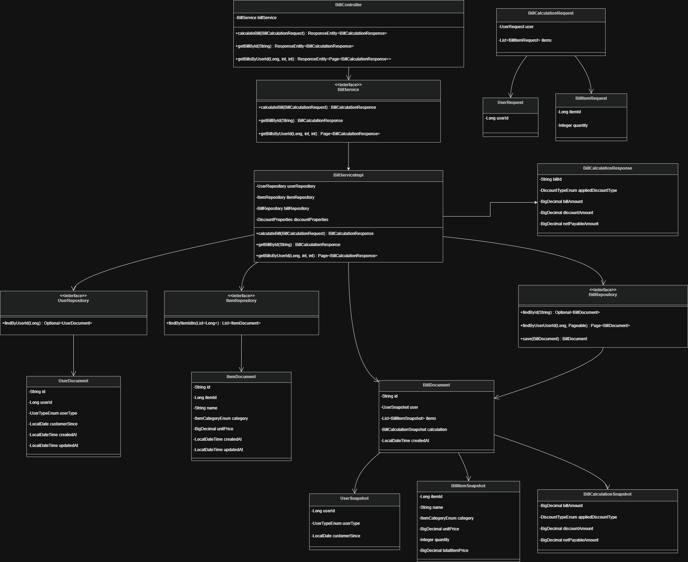
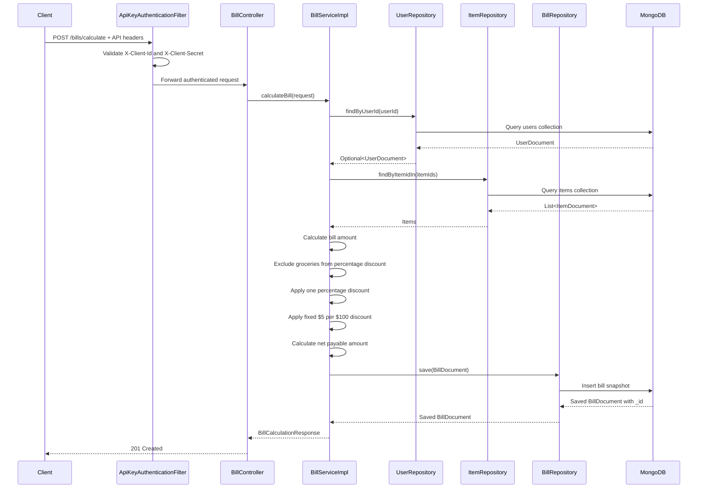

# Retail Discount Service

Retail Discount Service is a Spring Boot REST API that calculates the net payable amount for a retail bill based on configured discount rules.

The service uses MongoDB for persistence, supports Docker Compose startup, applies API-key security, stores calculated bill history, and includes service/controller tests using Mockito, MockMvc, and JaCoCo coverage reporting.

---

## Tech Stack

- Java 21
- Spring Boot 4
- Spring Web MVC
- Spring Security
- Spring Data MongoDB
- MongoDB 7
- Maven
- Docker / Docker Compose
- JUnit 5
- Mockito
- MockMvc
- JaCoCo
- Lombok

---

## Persistence Design Note: MongoDB vs Hibernate JPA

The assessment mentions both **Hibernate JPA** and **MongoDB persistence**. This implementation uses **Spring Data MongoDB** because MongoDB was explicitly required as the persistence layer.

The application models are stored as MongoDB documents using Spring Data MongoDB repositories instead of relational JPA entities. Hibernate/JPA was not added because it is designed for relational database persistence, while this project persists users, items, and bills in MongoDB collections.

This is an intentional design decision to keep the solution aligned with the MongoDB requirement and avoid adding unused relational persistence code.

---

## Business Rules

The retail website applies these discount rules:

1. If the user is an employee, they get a `30%` discount.
2. If the user is an affiliate, they get a `10%` discount.
3. If the user has been a customer for more than 2 years, they get a `5%` discount.
4. For every full `$100` on the bill, the user gets `$5` discount.
    - Example: `$990` gives `$45` fixed discount.
5. Percentage-based discounts do not apply to groceries.
6. A user can get only one percentage-based discount per bill.
7. The `$5 per $100` discount is applied additionally.

---

## Discount Priority

Only one percentage discount is applied:

```text
EMPLOYEE 30%
else AFFILIATE 10%
else CUSTOMER_OVER_TWO_YEARS 5%
else NONE
```

The fixed discount is always calculated from the full bill amount:

```text
floor(billAmount / 100) * 5
```

---

## Persistence Note

The assessment lists Hibernate JPA and MongoDB. Since MongoDB is explicitly required for persistence, this project uses Spring Data MongoDB repositories instead of Hibernate/JPA entities.

The persistence model is document-based and stores users, items, and bill snapshots in MongoDB collections.

---

## Project Structure

```text
retail-discount-service/
├── db/
│   ├── init-mongo.js
├── docs/
│   └── uml-class-diagram.png
├── src/
│   ├── main/
│   │   ├── java/com/d360/retailDiscountService/
│   │   │   ├── config/
│   │   │   ├── controller/
│   │   │   ├── exception/
│   │   │   ├── model/
│   │   │   ├── repository/
│   │   │   └── service/
│   │   └── resources/
│   │       ├── application.yaml
│   │       ├── application-local.yml
│   │       └── application-cloud.yml
│   └── test/
│       └── java/com/d360/retailDiscountService/
├── Dockerfile
├── docker-compose.yml
├── .dockerignore
├── .env.example
├── pom.xml
└── README.md
```

---

## Architecture Overview

```text
Client
  |
  | HTTP + API Key Headers
  v
ApiKeyAuthenticationFilter
  |
  v
BillController
  |
  v
BillServiceImpl
  |
  +--> UserRepository  --> MongoDB users
  +--> ItemRepository  --> MongoDB items
  +--> BillRepository  --> MongoDB bills
```

---

## UML Class Diagram

The following diagram shows the high-level design of the key classes in the solution.



---

## Calculate Bill Sequence Diagram



---

## Database Design

### `users`

Stores trusted user information used to determine the discount type.

```json
{
  "_id": "ObjectId",
  "userId": 1001,
  "userType": "EMPLOYEE",
  "customerSince": "2020-01-15",
  "createdAt": "date",
  "updatedAt": "date"
}
```

### `items`

Stores trusted item data used for price and category.

```json
{
  "_id": "ObjectId",
  "itemId": 2001,
  "name": "Rice",
  "category": "GROCERY",
  "unitPrice": 50.00,
  "createdAt": "date",
  "updatedAt": "date"
}
```

### `bills`

Stores bill snapshots after calculation.

MongoDB `_id` is used as the public `billId` in API responses.

```json
{
  "_id": "ObjectId",
  "user": {
    "userId": 1001,
    "userType": "EMPLOYEE",
    "customerSince": "2020-01-15"
  },
  "items": [
    {
      "itemId": 2001,
      "name": "Rice",
      "category": "GROCERY",
      "unitPrice": 50.00,
      "quantity": 2,
      "totalItemPrice": 100.00
    }
  ],
  "calculation": {
    "billAmount": 400.00,
    "appliedDiscountType": "EMPLOYEE",
    "discountAmount": 110.00,
    "netPayableAmount": 290.00
  },
  "createdAt": "date"
}
```

---

## MongoDB Initialization Scripts

The Docker setup uses two Mongo initialization scripts under the `db/` folder.

### `db/init-mongo.js`

Creates the application database structure:

```text
retail_discount_db
├── users
├── items
└── bills
```

It also creates validators, indexes, and sample seed data.

```text
retail_discount_db
```

MongoDB initialization scripts only run when the Mongo volume is created for the first time. To force them to rerun:

```bash
docker compose down -v --remove-orphans
docker compose up --build
```

---

## Environment Variables

Create a `.env` file from `.env.example`.

On Linux/macOS:

```bash
cp .env.example .env
```

On Windows PowerShell:

```powershell
Copy-Item .env.example .env
```

Example values:

```env
MONGO_ROOT_USERNAME=root
MONGO_ROOT_PASSWORD=root_password_123

MONGO_APP_USERNAME=retail_app_user
MONGO_APP_PASSWORD=retail_app_password_123
MONGO_DATABASE=retail_discount_db

APP_CLIENT_ID=retail-app-v1
APP_CLIENT_SECRET=super-secret-key-789

SERVER_PORT=8080
```

These values are for local development only.

Do not commit the real `.env` file.

---

## Running Locally Without Docker

Start MongoDB locally first.

Then run:

```bash
mvn clean spring-boot:run -Dspring-boot.run.profiles=local
```

Local Mongo config:

```yaml
spring:
  mongodb:
    uri: mongodb://localhost:27017/retail_discount_db
```

---

## Running With Docker Compose

From the project root:

```bash
docker compose down -v --remove-orphans
docker compose up --build
```

For detached mode:

```bash
docker compose up --build -d
```

Check containers:

```bash
docker ps
```

Check logs:

```bash
docker logs -f retail-discount-service
docker logs -f retail-discount-mongo
```

Stop services:

```bash
docker compose down
```

Reset Docker database:

```bash
docker compose down -v --remove-orphans
docker compose up --build
```

---

## API Security

All bill APIs require these headers:

```http
X-Client-Id: retail-app-v1
X-Client-Secret: super-secret-key-789
```

Missing or invalid headers return:

```http
401 Unauthorized
```

---

## API Endpoints

Base URL when running locally or with Docker:

```text
http://localhost:8080/discount-service
```

---

## 1. Calculate Bill

### Request

```http
POST /discount-service/bills/calculate
Content-Type: application/json
X-Client-Id: retail-app-v1
X-Client-Secret: super-secret-key-789
```

### Body

```json
{
  "user": {
    "userId": 1001
  },
  "items": [
    {
      "itemId": 2001,
      "quantity": 2
    },
    {
      "itemId": 2002,
      "quantity": 1
    }
  ]
}
```

### Example Calculation

```text
User 1001 = EMPLOYEE

Item 2001 = Rice, GROCERY, 50.00 × 2 = 100.00
Item 2002 = Headphones, OTHER, 300.00 × 1 = 300.00

Bill amount = 400.00

Employee discount applies only to non-grocery:
300.00 × 30% = 90.00

Fixed discount:
floor(400 / 100) × 5 = 20.00

Total discount = 90.00 + 20.00 = 110.00

Net payable = 400.00 - 110.00 = 290.00
```

### Response

```json
{
  "billId": "69f506d407197d4424d337af",
  "appliedDiscountType": "EMPLOYEE",
  "billAmount": 400.00,
  "discountAmount": 110.00,
  "netPayableAmount": 290.00
}
```

### Curl

```bash
curl -i -X POST "http://localhost:8080/discount-service/bills/calculate" \
  -H "X-Client-Id: retail-app-v1" \
  -H "X-Client-Secret: super-secret-key-789" \
  -H "Content-Type: application/json" \
  -d '{
    "user": {
      "userId": 1001
    },
    "items": [
      {
        "itemId": 2001,
        "quantity": 2
      },
      {
        "itemId": 2002,
        "quantity": 1
      }
    ]
  }'
```

Windows PowerShell:

```powershell
curl.exe -i -X POST "http://localhost:8080/discount-service/bills/calculate" `
  -H "X-Client-Id: retail-app-v1" `
  -H "X-Client-Secret: super-secret-key-789" `
  -H "Content-Type: application/json" `
  -d '{
    "user": {
      "userId": 1001
    },
    "items": [
      {
        "itemId": 2001,
        "quantity": 2
      },
      {
        "itemId": 2002,
        "quantity": 1
      }
    ]
  }'
```

---

## 2. Get Bill By ID

### Request

```http
GET /discount-service/bills/{billId}
X-Client-Id: retail-app-v1
X-Client-Secret: super-secret-key-789
```

### Curl

```bash
curl -i -X GET "http://localhost:8080/discount-service/bills/YOUR_BILL_ID" \
  -H "X-Client-Id: retail-app-v1" \
  -H "X-Client-Secret: super-secret-key-789"
```

Windows PowerShell:

```powershell
curl.exe -i -X GET "http://localhost:8080/discount-service/bills/YOUR_BILL_ID" `
  -H "X-Client-Id: retail-app-v1" `
  -H "X-Client-Secret: super-secret-key-789"
```

---

## 3. Get Bills By User ID

### Request

```http
GET /discount-service/bills/user/{userId}?page=0&size=10
X-Client-Id: retail-app-v1
X-Client-Secret: super-secret-key-789
```

### Curl

```bash
curl -i -X GET "http://localhost:8080/discount-service/bills/user/1001?page=0&size=10" \
  -H "X-Client-Id: retail-app-v1" \
  -H "X-Client-Secret: super-secret-key-789"
```

Windows PowerShell:

```powershell
curl.exe -i -X GET "http://localhost:8080/discount-service/bills/user/1001?page=0&size=10" `
  -H "X-Client-Id: retail-app-v1" `
  -H "X-Client-Secret: super-secret-key-789"
```

### Response

```json
{
  "content": [
    {
      "billId": "69f506d407197d4424d337af",
      "appliedDiscountType": "EMPLOYEE",
      "billAmount": 400.00,
      "discountAmount": 110.00,
      "netPayableAmount": 290.00
    }
  ],
  "pageable": {
    "pageNumber": 0,
    "pageSize": 10
  },
  "totalElements": 1,
  "totalPages": 1,
  "last": true,
  "size": 10,
  "number": 0
}
```

---

## Error Response Format

Handled errors return a structured response.

```json
{
  "timestamp": "2026-05-03T00:00:00",
  "traceId": "trace-id-value",
  "status": 404,
  "error": "Not Found",
  "errorCode": 1001,
  "message": "User not found",
  "path": "/discount-service/bills/calculate",
  "details": []
}
```

---

## Error Codes

| Error Code | HTTP Status | Message |
|---:|---:|---|
| 1001 | 404 | User not found |
| 1002 | 404 | Item not found |
| 1003 | 404 | Bill not found |
| 2001 | 400 | Validation failed |
| 2002 | 400 | Invalid request |
| 3001 | 401 | Invalid client id or secret |
| 9001 | 500 | Unexpected error occurred |

---

## Trace ID

Every request gets a `traceId`.

The service accepts:

```http
X-Trace-Id: custom-trace-id
```

If not provided, the service generates one automatically.

The `traceId` appears in logs and error responses.

Example log:

```text
2026-05-03T00:00:00.000+03:00 INFO [traceId=abc-123] c.d.r.controller.BillController : Received bill calculation request
```

---

## Tests

Run all tests:

```bash
mvn test
```

Expected successful result:

```text
Failures: 0
Errors: 0
BUILD SUCCESS
```

Current test coverage includes:

```text
Service unit tests using Mockito
Controller tests using MockMvc
Security header tests
Business exception mapping tests
Pagination API tests
Validation error tests
TraceId filter tests
Exception handler tests
```

---

## Testing Strategy

### Service Tests

Service tests use Mockito only.

They do not start Spring context and do not connect to MongoDB.

Covered scenarios:

- Employee discount
- Affiliate discount
- Loyal customer discount
- New customer discount
- Grocery exclusion from percentage discount
- Fixed `$5 per $100` discount
- User not found
- Item not found
- Bill not found
- Paginated bill history

### Controller / Security Tests

Controller tests use MockMvc.

Covered scenarios:

- Missing API headers
- Invalid API headers
- Valid API headers
- Invalid request body
- Successful calculation
- Get bill by ID
- Get bills by user ID
- Business exception mapping

---

## Code Coverage

The project uses JaCoCo to generate code coverage reports.

Generate coverage report:

```bash
mvn clean verify
```

After the command finishes, open:

```text
target/site/jacoco/index.html
```

Current coverage summary:

```text
Instruction coverage: 99%
Branch coverage: 82%
Line coverage: 100%
Method coverage: 100%
Class coverage: 100%
```

The service layer, which contains the main discount calculation logic, has 100% instruction coverage.

---

## Main Commands

### Build

```bash
mvn clean package
```

### Test

```bash
mvn test
```

### Generate coverage report

```bash
mvn clean verify
```

### Run locally

```bash
mvn spring-boot:run -Dspring-boot.run.profiles=local
```

### Run with Docker

```bash
docker compose up --build
```

### Run with Docker in detached mode

```bash
docker compose up --build -d
```

### Stop Docker

```bash
docker compose down
```

### Reset Docker database

```bash
docker compose down -v --remove-orphans
docker compose up --build
```


## SonarQube Quality Report Results

A SonarQube analysis was executed successfully using the Maven SonarScanner.

Command used:

```bash
mvn clean verify sonar:sonar \
  -Dsonar.host.url=http://localhost:9000 \
  -Dsonar.token=YOUR_TOKEN
```

| Metric            |              Result |
| ----------------- | ------------------: |
| Quality Gate      |              Passed |
| Security          |       0 open issues |
| Reliability       |       0 open issues |
| Maintainability   |      20 open issues |
| Coverage          |               97.8% |
| Duplications      |                0.0% |
| Tests             | 38 passed, 0 failed |
| Build             |             Success |
| Security Hotspots |                   1 |


---


## Final Notes

- MongoDB `_id` is used as `billId` in the API response.
- `userId` and `itemId` remain business IDs.
- Item price and category are always loaded from the database.
- The request does not provide trusted prices or categories.
- Bills are saved as snapshots to preserve historical calculation data.
- Docker Mongo initialization scripts run only when the Mongo volume is created for the first time.
